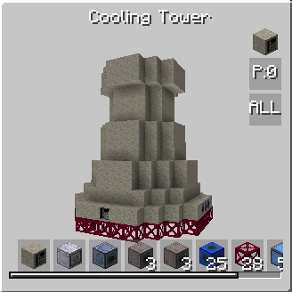

# GregTech - True Age of Steam

**GregTech - True Age of Steam** is a [GregTech Modern](https://github.com/GregTechCEu/GregTech-Modern) addon for Minecraft 1.20.1 that focuses on **steam production**.

It introduces new machines and multiblocks all connected to an ultimate goal: increased and more efficient steam output.

## Multiblocks

-   

    ---

    **Coating Shrine** &nbsp;·&nbsp; :material-flash-off: Pre-LV

    Mysterious multiblock that helps you infuse soild materials with properties of fluids.

    [:octicons-arrow-right-24: Read more](multiblocks/coating-shrine.md)

-   

    ---

    **Infernal Boiler** &nbsp;·&nbsp; :material-lightning-bolt: MV

    Boiler build from infernal alloy materials, capable of producing enormous amount of energy in steam form if maintained properly.

    [:octicons-arrow-right-24: Read more](multiblocks/infernal-boiler.md)

-   

    ---

    **Cooling Box** &nbsp;·&nbsp; :material-lightning-bolt: MV

    Multiblock for passive cooling for different fluids and gases.

    [:octicons-arrow-right-24: Read more](multiblocks/cooling-box.md)

-   

    ---

    **Concept Infusion Matrix** &nbsp;·&nbsp; :material-lightning-bolt: HV

    Multiblock that allows producing of concept catalyst and opens access to large variety of cometals.

    [:octicons-arrow-right-24: Read more](multiblocks/concept-infusion-matrix.md)

-   

    ---

    **Industrial Gas Pressurizer** &nbsp;·&nbsp; :material-lightning-bolt: HV

    Multiblock for compressing steams into dense form.

    [:octicons-arrow-right-24: Read more](multiblocks/industrial-gas-pressurizer.md)

-   

    ---

    **Spawner extraction machine** &nbsp;·&nbsp; :material-lightning-bolt: HV

    Multiblock for extracting loot from spawners and crafting hellish water.

    [:octicons-arrow-right-24: Read more](multiblocks/spawner-extraction-machine.md)

-   

    ---

    **Cooling tower** &nbsp;·&nbsp; :material-lightning-bolt: EV

    Industrial-grade passive cooling facility.

    [:octicons-arrow-right-24: Read more](multiblocks/cooling-tower.md)

