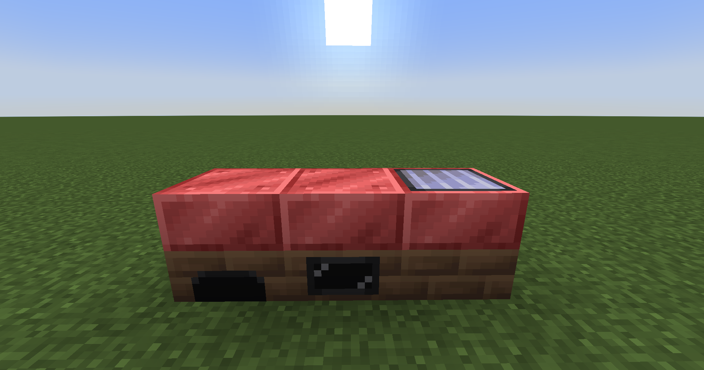

# Single-Block Boilers

-   <figure markdown>
    
    <figcaption>Lava-Coated Boilers</figcaption>
    </figure>

    |                    |                     |
    |--------------------|---------------------|
    | **Type**           | Single-block        |
    | **Unlock at tier** | ULV                 |
    | **Output**         | ×2 vs High Pressure |

-   <figure markdown>
    
    <figcaption>Infernal Single-Block Boilers</figcaption>
    </figure>

    |                    |                     |
    |--------------------|---------------------|
    | **Type**           | Single-block        |
    | **Unlock at tier** | MV                  |
    | **Output**         | ×4 vs High Pressure |

-   <figure markdown>
    
    <figcaption>Heating charged Single-Block Boilers</figcaption>
    </figure>

    |                    |                     |
        |--------------------|---------------------|
    | **Type**           | Single-block        |
    | **Unlock at tier** | HV                  |
    | **Output**         | ×8 vs High Pressure |

The addon adds new tiers of single-block boilers that extend the vanilla GregTech boiler line beyond the High Pressure variants. They all have boosted output which they archive by more-effective fuel consumption, so for example, for same amount of fluid, Lava coated solid boiler would produce twice as much steam as high pressure solid boiler.