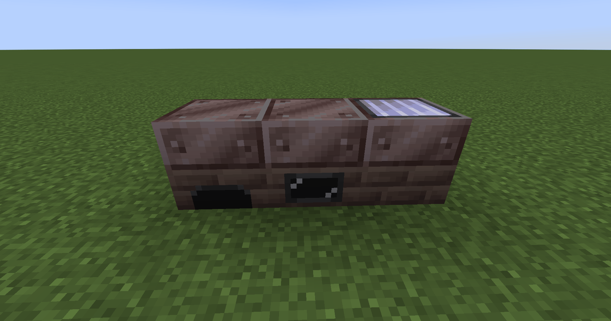
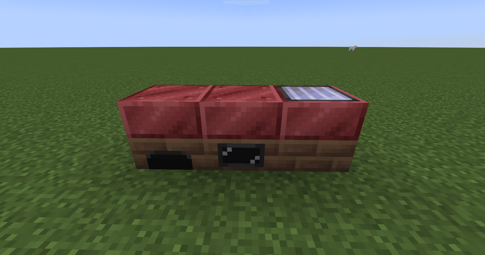

# Single-Block Boilers

<div class="grid cards" markdown>

-   <figure markdown>
    
    <figcaption>Lava-Coated Boiler</figcaption>
    </figure>

    | | |
    |---|---|
    | **Type** | Single-block |
    | **Voltage tier** | LV |
    | **Output** | ×1.5 vs High Pressure |

-   <figure markdown>
    
    <figcaption>Infernal Single-Block Boiler</figcaption>
    </figure>

    | | |
    |---|---|
    | **Type** | Single-block |
    | **Voltage tier** | MV |
    | **Output** | ×2.0 vs High Pressure |

</div>

The addon adds two new tiers of single-block boilers that extend the vanilla GregTech boiler line beyond the High Pressure variants.

## Lava-Coated Boiler

| Property | Value |
|----------|-------|
| Crafted from | High Pressure Boiler + Lava-Coated Steel Plates |
| Output | **×1.5** of the equivalent High Pressure Boiler |
| Unlock | Same tier as High Pressure Boilers |

The Lava-Coated Boiler is a direct upgrade path from the High Pressure line. Craft lava-coated steel plates and combine them with an existing High Pressure Boiler to produce one.

## Infernal Single-Block Boiler

| Property | Value |
|----------|-------|
| Requires | MV (needs Aluminium ingots for Infernal Alloy) |
| Output | **×2** of the equivalent High Pressure Boiler variant |
| Unlock | MV |

The Infernal single-block boiler is the top tier of the single-block line. Its crafting is gated behind MV because Infernal Alloy requires aluminium ingots, which are themselves an MV-era material.

## Comparison

```
High Pressure Boiler  →  ×1.0 (baseline)
Lava-Coated Boiler    →  ×1.5
Infernal Boiler       →  ×2.0
```

For large-scale superheated steam production, consider the [Infernal Boiler multiblock](../multiblocks/infernal-boiler.md) instead, which can far exceed these outputs at Supreme heat level.
