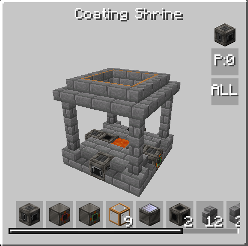

# Coating Shrine

<figure markdown>

<figcaption>Coating Shrine</figcaption>
</figure>

| | |
|---|---|
| **Type** | Multiblock |
| **Unlock at** | ULV |
| **Energy input** | None |

The Coating Shrine is a **pre-LV multiblock** that allows you to infuse materials with fluid properties. It is the first multiblock of this addon, that helps you to create new materials. 

## How it works

Place a fluid in the center of the multiblock structure. The fluid present determines which recipes are available — different fluids unlock different infusion recipes.

A single fluid fill provides **100 crafting operations** before it is consumed and must be refilled.

!!! tip
    Right-click the controller to see how many crafting operations remain for the current fluid.
