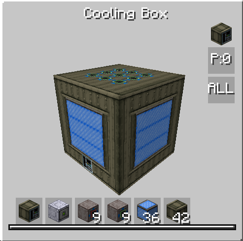

# Cooling Box

<figure markdown>

<figcaption>Cooling Box</figcaption>
</figure>

| | |
|---|---|
| **Type** | Multiblock |
| **Voltage tier** | MV |
| **Energy** | None |
| **Key mechanic** | Passive cooling accumulation |

The Cooling Box is a multiblock designed to provide **passive cooling**, primarily for recycling the charging fluid consumed by the [Infernal Boiler](infernal-boiler.md).

## How it works

The Cooling Box accumulates cooling capacity passively over time. The rate and maximum capacity are determined by the **cooling coils** installed in the structure.

Once enough capacity has been accumulated, it is spent to perform cooling crafts automatically.

!!! tip
    Right-click the controller to see the current accumulated cooling capacity and the maximum for your installed coil tier.

## Key characteristics

- Fully passive — no active input required between cooling cycles
- Maximum cooling capacity scales with cooling coil tier
- Accumulation rate also scales with cooling coil tier
- Pairs directly with the Infernal Boiler to close the fluid loop

## Setup tips

- Use the highest coil tier available to maximise both the accumulation rate and the capacity ceiling.
- Place the Cooling Box near your boiler setup to simplify fluid piping.
