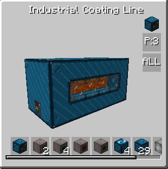

# Industrial Coating Line

<figure markdown>

<figcaption>Industrial Coating Line</figcaption>
</figure>
| | |
|---|---|
| **Type** | Multiblock |
| **Unlock at** | HV |
| **Energy input** | HV |

The Industrial Coating Line is the **HV-tier upgrade** of the [Coating Shrine](./coating-shrine.md). It delivers far higher throughput and no longer consumes the fluid source — instead it draws a small amount from fluid input hatches.

## Lining the unline

Unlike its predecessor, Coating line could perform operations in parallel. You can repeat layer with fluid in the middle up to 12 times, each time will grant parallel for recipe that require specific fluid. You can also use different fluids inside one coating line, to perform coating for several fluids with the same machine. 
