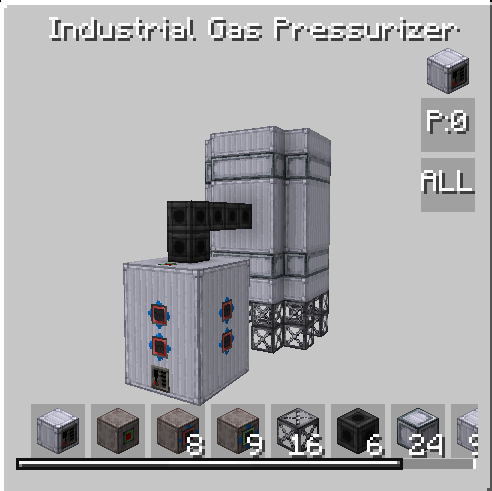

# Industrial gas pressurizer

<figure markdown>

<figcaption>Industrial gas pressurizer</figcaption>
</figure>

| |            |
|---|------------|
| **Type** | Multiblock |
| **Voltage tier** | HV         |
| **Energy input** | 2          |

???

## How it works

???
