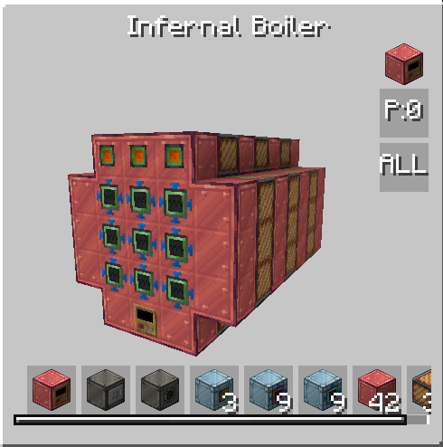

# Infernal Boiler

<figure markdown>

<figcaption>Infernal Boiler</figcaption>
</figure>

| | |
|---|---|
| **Type** | Multiblock |
| **Voltage tier** | MV |
| **Energy input** | Up to 3 |

Infused with the power of infernal alloy, the Infernal Boiler is the first powerhouse of the addon's steam production. It produces **superheated steam** rather than ordinary steam, making it far more energy-dense than vanilla GregTech boilers.

## Mechanics

The boiler has two independent systems that interact to determine its output: **Heat** and **Charges**.

### Heat

Each completed crafting operation increases the boiler's heat. Heat is divided into levels, and crossing a threshold raises the current level. The higher the level, the more parallels boiler can use. At the latest level - Supreme heat, parallels are combined with superheating effect to produce truly enormous amount of superheated steam.

While boiler isn't active, heat level starts to drop. Better coils slow the idle heat decay, making it easier to sustain Supreme level between batches.

### Charges

The boiler requires charges to operate. When charges run out, it can **only** process recipes that restore charges — all other recipes are locked until the charge is replenished.

??? note "How to handle switching between recipes"
    
    As you may notice, you suppose somehow to alter between two crafting recipes. By default boiler will always try to craft recipe it was used previously, which is useful for continious steam producing. When charges run out, you need to have a hatch with correct fluid and circuit ready to perform maintaince recipe. To avoid stucking in maintaince loop, you can try using ulv hatch and fluid regulator to feel hatch slowly, thus making maintaince loop impossible, since boiler will start producing steam again after single maintaince, because there is not enough maintance fluid.

??? note "Energy produciton"

    You can use [this](https://docs.google.com/spreadsheets/d/1y3mynehGAV7hHjiIa9eH1HNlcbUSV-bjoIrED02l3pM/edit?usp=sharing) excel table to check how many steam boiler suppose to produce. 