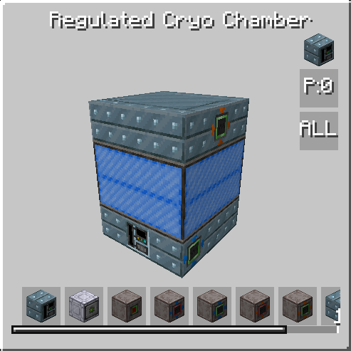

# Regulated Cryo Control

<figure markdown>

<figcaption>Regulated Cryo Control</figcaption>
</figure>

| |            |
|---|------------|
| **Type** | Multiblock |
| **Voltage tier** | EV         |
| **Energy input** | 2          |

Regulated Cryo Control (or RCC for short) is slightly better version of Vacuum Freezer. 

## How it works

RCC performs same recipes as Vacuum Freezer, but it able to utilize cooling coils to reuse cooling left from previous craft. Continious crafts receive speed boot, based on level of cooling coils.

Level of cooling coils also add energy-free parallels. On first level, RCC will have 2 parallels, on second level - 3, etc. Level of cooling coils also determine base voltage level for recipe that got perfect OC. For first level it will be ULV, for second LV, for third MV, etc. 

Unlike Vacuum Freezer it doesn't have batch mode, so for some use cases it still can be worse than Vacuum Freezer itself.

??? info "Again, how speed reduction works?"

    For example, you use coils with duration reduction 10%. Each continuous craft will slowly bring duration reduction closer to this number, with 100 crafting fully driving reduction to 10%.
    