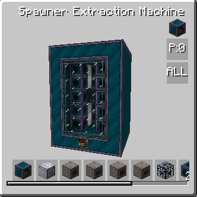

# Spawner extraction machine

<figure markdown>

<figcaption>Spawner extraction machine</figcaption>
</figure>

| |            |
|---|------------|
| **Type** | Multiblock |
| **Voltage tier** | HV         |
| **Energy input** | 2          |

Spawner extraction machine is designed to help player farm resources from spawners directly. Just build one around spawner and you ready to go. 

It uses extraction cometal, crafted with help of extraction catalyst that can be created in [Concept Infusion Matrix](concept-infusion-matrix.md)

## How it works

Main purpose of spawner extraction machine is to farm mob loot. Insert sword and some extraction air and machine will start slowly producing mob output. Each new craft is additional mob loot roll. 

Sword durability will be consumed on each craft. Sword damage impacts speed of recipe, with iron sword being a baseline for speed. Some enchantments will also affect output, looting will work as intended, sharpness will descrese recipe duration and unbreaking will reduce durability loss for sword.

Additional use of spawner extraction machine is fluid manipulation. It can duplicate some mob-related fluids if specific mob spawner inside, for example, blaze with Blaze inside or lava with Magma Cube inside.
It also can produce Hellish water if mob related to nether inside.
